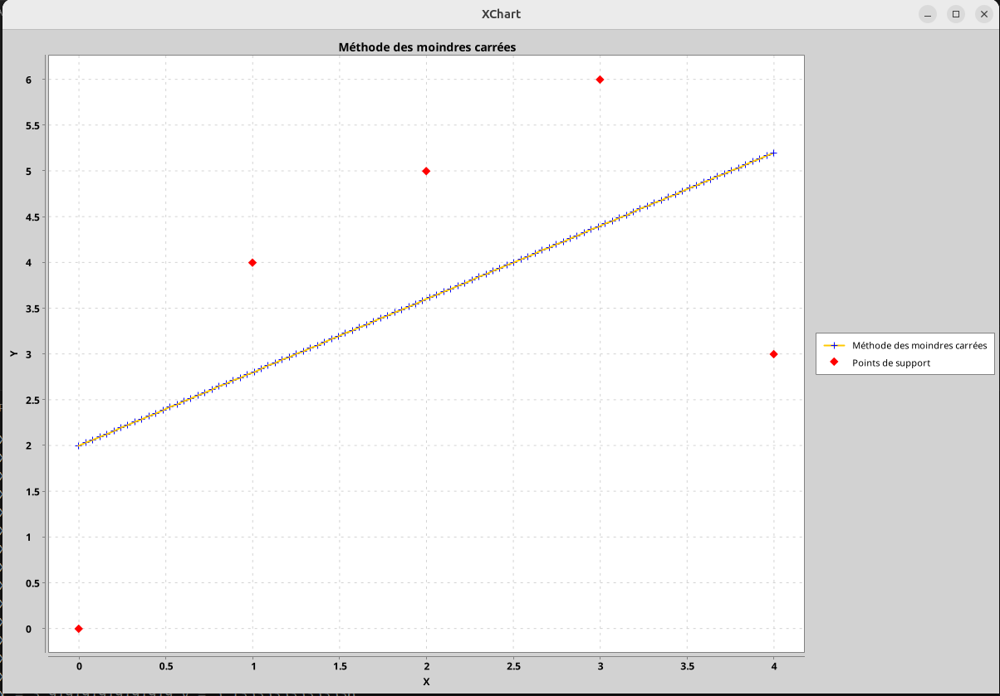

# Projet Align - Bibliothèque de Calcul Numérique et d'Interpolation

Une bibliothèque Java complète pour le calcul matriciel, la résolution de systèmes linéaires, l'interpolation et la régression polynomiale avec visualisation graphique.

## 🚀 Fonctionnalités Principales

### 🔢 Calcul Matriciel Avancé
- **Opérations matricielles** : Addition, multiplication, transposition
- **Décomposition LDR** (factorisation de Cholesky modifiée)
- **Calcul d'inverse** avec méthodes numériquement stables
- **Normes matricielles** : L1, L2, L∞
- **Conditionnement** : Analyse de la stabilité numérique
- **Matrices de Hilbert** : Test de conditionnement extrême

### ⚡ Résolution de Systèmes Linéaires
- **Systèmes triangulaires** (inférieurs/supérieurs)
- **Systèmes diagonaux**
- **Méthode de Thomas** pour matrices tridiagonales
- **Algorithme de Helder** (décomposition LDR)
- **Validation** par calcul des résidus et normes

### 📊 Interpolation et Approximation
- **Splines cubiques naturelles** avec méthode de Thomas
- **Régression polynomiale** par moindres carrés
- **Gestion des oscillations** (phénomène de Runge)
- **Validation hors limites** avec exceptions personnalisées

### 📈 Visualisation des Données
- **Graphiques interactifs** avec XChart
- **Comparaison** points originaux vs courbes ajustées
- **Interface utilisateur** pour paramétrage dynamique

## 🛠️ Architecture du Projet

```
Align/
├── src/main/java/Align/
│   ├── Matrice.java              # Classe de base pour matrices
│   ├── Vecteur.java              # Vecteurs héritant de Matrice
│   ├── Helder.java               # Décomposition LDR
│   ├── SysLin.java               # Classe abstraite systèmes linéaires
│   ├── Thomas.java               # Algorithme de Thomas
│   ├── Spline.java               # Interpolation par splines cubiques
│   ├── ModPoly.java              # Régression polynomiale
│   ├── MainTest.java             # Interface principale avec GUI
│   └── CSVLoader.java            # Chargement de données
└── src/Resources/
    └── data.csv                  # Données d'exemple
```

## 🎯 Cas d'Usage


### 1. Calcul Matriciel
```java
// Création et manipulation de matrices
Matrice A = new Matrice("matrice.txt");
Matrice inverse = A.inverse();
double conditionnement = A.cond_1();
```

### 2. Résolution de Systèmes
```java
// Système Ax = b
Helder helder = new Helder(matrice, secondMembre);
Vecteur solution = helder.resolution();
```

### 3. Interpolation par Splines
```java
// Splines cubiques naturelles
Spline spline = new Spline(x, y);
double valeur = spline.interpolate(2.5);
```

### 4. Régression Polynomiale
```java
// Ajustement polynomial de degré n
ModPoly modele = new ModPoly(3);
modele.identify(x, y);
double prediction = modele.eval(xNouveau);
```

## 📊 Exemples de Visualisation

Le projet génère des graphiques interactifs montrant :

### Régression Polynomiale

*Régression polynomiale avec points de support*

### Interpolation par Splines

*Interpolation par splines cubiques*

### Analyse du Conditionnement

*Analyse du conditionnement des matrices de Hilbert*

### Autres Visualisations


*Analyse du conditionnement des matrices de Hilbert*

## 🔧 Installation et Utilisation

### Prérequis
- Java 17+
- Maven 3.6+

### Installation
```bash
git clone [votre-repo]
cd Align
mvn clean compile
```

### Exécution
```bash
# Régression polynomiale interactive
mvn exec:java -Dexec.mainClass="Align.MainTest"

# Tests individuels
mvn exec:java -Dexec.mainClass="Align.Spline"
mvn exec:java -Dexec.mainClass="Align.HilbertMatrice"
```

## 🧪 Validation Numérique

Le projet implémente des tests rigoureux :
- **Vérification des résidus** : ||Ax - b|| < ε
- **Tests de conditionnement** sur matrices de Hilbert
- **Validation des normes** L1, L2, L∞
- **Gestion des cas limites** et exceptions

## 📚 Concepts Mathématiques Implémentés

### Algèbre Linéaire
- Décomposition LDR (L·D·R = A)
- Conditionnement κ(A) = ||A|| · ||A⁻¹||
- Normes matricielles et vectorielles

### Analyse Numérique
- Stabilité des algorithmes
- Propagation d'erreurs
- Précision machine (ε = 10⁻⁶)

### Interpolation
- Splines cubiques C² continues  
- Méthode des moindres carrés
- Minimisation de ||Ax - b||²

## 🎓 Applications Pédagogiques

Ce projet illustre :
- **Programmation orientée objet** avancée
- **Algorithmes numériques** fondamentaux
- **Gestion d'erreurs** et validation
- **Visualisation** de données scientifiques
- **Architecture logicielle** modulaire

## 🔬 Extensions Possibles

- Décomposition SVD
- Méthodes itératives (Jacobi, Gauss-Seidel)
- Interpolation de Lagrange
- Détection automatique du phénomène de Runge
- Export des résultats en formats scientifiques

## 📋 Dépendances

```xml
<dependency>
    <groupId>org.knowm.xchart</groupId>
    <artifactId>xchart</artifactId>
    <version>3.8.8</version>
</dependency>
<dependency>
    <groupId>org.junit.jupiter</groupId>
    <artifactId>junit-jupiter-api</artifactId>
    <scope>test</scope>
</dependency>
```

## 👨‍💻 Auteur

Développé dans le cadre d'un cours de Programmation Scientifique - Université [Nom]

---

*Ce projet démontre une maîtrise des concepts fondamentaux du calcul scientifique et de leur implémentation en Java, avec un focus sur la robustesse numérique et la visualisation des résultats.*
